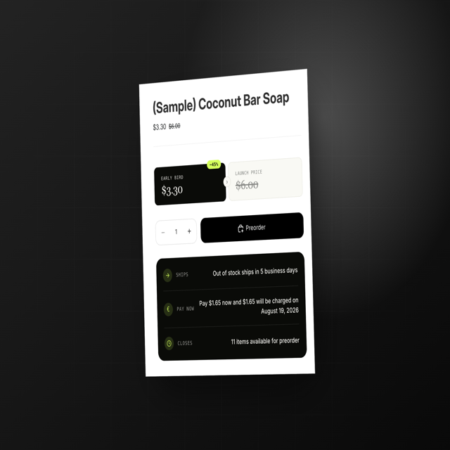
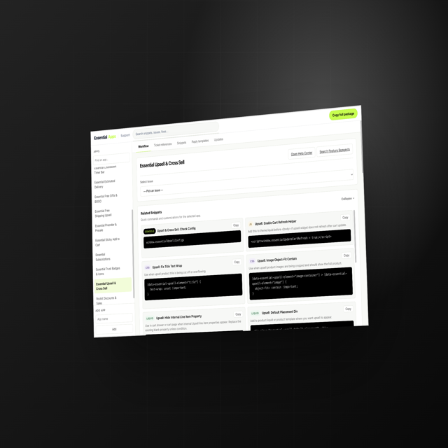

# Wendyle Seno — Technical Support Portfolio

Portfolio for [Wendyle Christian M. Seno](https://www.wendylechristianseno.com/), a SaaS Technical Support Engineer based in the Philippines with experience in Shopify and e-commerce troubleshooting, API investigation, browser debugging, support escalation, technical documentation, and front-end customization.

## Live portfolio

- Website: [https://www.wendylechristianseno.com/](https://www.wendylechristianseno.com/)
- LinkedIn: [Wendyle Christian M. Seno](https://www.linkedin.com/in/wendylechristianseno/)
- GitHub: [Wendyle18](https://github.com/Wendyle18)
- Contact: [senowendyle793@gmail.com](mailto:senowendyle793@gmail.com?subject=Technical%20Support%20Opportunity)

## Support and technical capabilities

- SaaS and customer-facing technical support
- Shopify, WordPress, and BigCommerce troubleshooting
- API and browser-level issue investigation
- HTML, CSS, and JavaScript customization
- Support escalation with reproducible evidence
- Technical documentation, knowledge bases, and reply workflows
- Salesforce Service Cloud and Help Scout experience

## Site pages

- [SaaS technical support in the Philippines](https://www.wendylechristianseno.com/saas-technical-support-philippines/)
- [Case-study collection](https://www.wendylechristianseno.com/case-studies/)
- [Work with Wendyle](https://www.wendylechristianseno.com/work-with-me/)
- [Privacy and analytics](https://www.wendylechristianseno.com/privacy/)

## Case studies

### [Preorder Campaign Widgets](https://www.wendylechristianseno.com/case-studies/preorder-campaign-widgets/)

Variant-aware Shopify storefront widgets that use active campaign data to present preorder pricing, savings, and fulfillment context responsively.

[](https://www.wendylechristianseno.com/case-studies/preorder-campaign-widgets/)

### [Essential Apps Support Guide v2](https://www.wendylechristianseno.com/case-studies/essential-apps-support-guide/)

A browser-based support dashboard that organizes app-specific troubleshooting guides, investigation checklists, snippets, reply templates, ticket references, and engineering escalation context.

[](https://www.wendylechristianseno.com/case-studies/essential-apps-support-guide/)

## Technology

The portfolio is intentionally lightweight:

- Semantic HTML
- Responsive CSS with reduced-motion support
- Progressive JavaScript enhancements
- JSON-LD structured data
- AVIF images with PNG or JPEG fallbacks
- Static deployment on Vercel
- Existing Google Analytics 4 tag with delegated, privacy-conscious conversion-event tracking

No build step, framework, large client library, or unnecessary third-party script is required.

## Run locally

From the repository root, start any static file server. For example:

```bash
python3 -m http.server 4173
```

Then open [http://localhost:4173/](http://localhost:4173/).

Opening `index.html` directly also works for the homepage, but a local server is recommended for testing directory-based pages, the custom 404, `robots.txt`, and `sitemap.xml`.

## Deployment

The production website is deployed as a static site on Vercel. The canonical public URL is:

```text
https://www.wendylechristianseno.com/
```

Deployment, DNS, Search Console submission, repository metadata, and profile updates are intentionally handled outside the source files.
